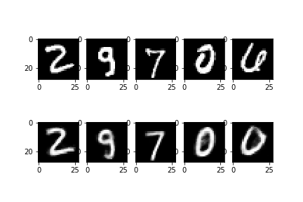
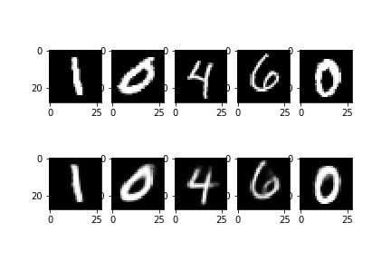
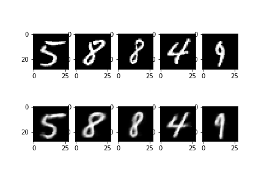
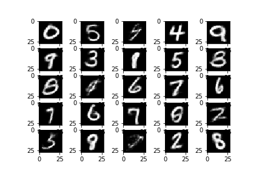
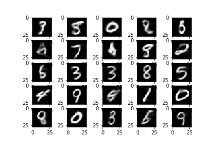
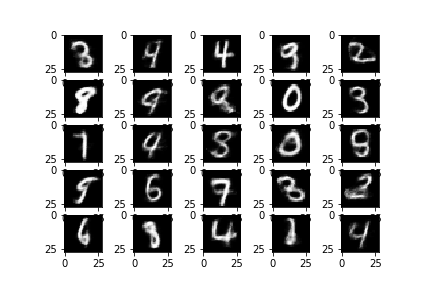
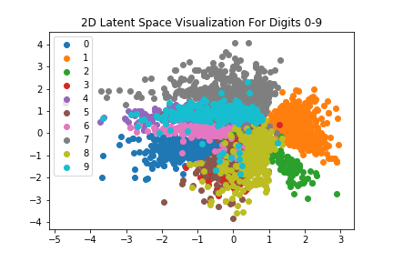

# Variational Auto-Encoder For MNIST Hand-Written Digits

Tensorflow implementation of Variational Autoencoder (VAE) trained on MNIST handwritten digits
Implementation and training was done on Google Collab GPU's.

## RESULTS

### Reconstructions

Validation set images reconstructed by the network

<table align='center'>
<tr align='center'>
<td> 8-D Encoding </td>
<td> 32-D Encoding </td>
<td>128-D Encoding </td>
</tr>
<tr>
<td>
<td>
<td>
</tr>
</table>

### Generation

New digits generated by sampling latent vectors from a standard multi-variate Gaussian

<table align='center'>
  <tr align='center'>
    <td> 8-D Encoding </td>
    <td> 32-D Encoding </td>
    <td> 128-D Encoding </td>
  </tr>
  <tr>
    <td></td>
    <td></td>
    <td></td>
  </tr>
</table>

### 2D Visualization of Latent Space

Generated latent vectors with encoding size 2.

<table align='center'>
  <tr align='center'>
    <td> Visualization Of 2-D Latent Space (Encoding Size 2)</td>
  </tr>
  <tr>
    <td></td>
</table>
